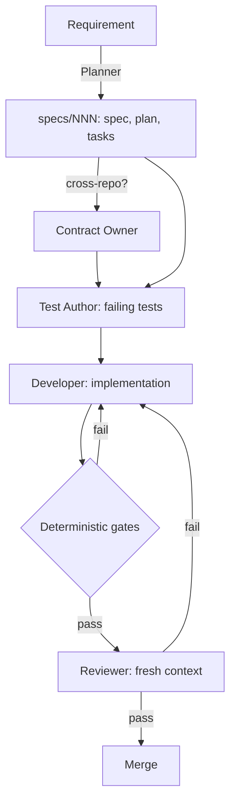

# Agent Fleet — anomalia-platform

> **Design doc for humans.** Agents do not load this file. The rules agents follow
> live in `AGENTS.md` / `CLAUDE.md` at the workspace root and in each service repo.

## 1. Principles

1. **Procedural contracts over personas.** Each role has explicit inputs, steps,
   outputs and a quality gate. No roleplay identities.
2. **Deterministic tools before LLMs.** Anything a linter, formatter, type checker,
   schema validator or test can decide is not an agent's job.
3. **Author ≠ reviewer.** The reviewer runs in a fresh context, sees only the spec and
   the diff, never the author's reasoning — ideally on a different model family.
4. **Tiers, not model versions.** This doc names capability tiers. Concrete models are
   set in each tool's config and reviewed quarterly.
5. **One agent = one repo worktree = one branch = one task.** Parallel agents never
   share a working tree.
6. **Start incremental.** Add a role only after the previous setup runs cleanly.

## 2. Model tiers

| Tier | Use for | Examples of the class |
| :--- | :--- | :--- |
| **A — Frontier reasoning** | Planning, contracts, review | Top-tier model of any major provider |
| **B — Coding** | Implementation, tests | Mid/top coding model in an agentic CLI |
| **C — Fast / cheap** | Bulk, mechanical, well-bounded tasks | Small hosted model; local only if quality is measured |

## 3. Roles

| # | Role | Tier | Runs in (herdr pane) | Writes | Output |
| :--- | :--- | :--- | :--- | :--- | :--- |
| 1 | **Planner** | A | Workspace root | `specs/NNN-*/` in target repo(s) | `spec.md`, `plan.md`, `tasks.md` (spec-kit) |
| 2 | **Test Author** | B | Target repo worktree | `tests/` only | Failing tests for each acceptance criterion |
| 3 | **Developer** | B | Target repo worktree | `src/` of assigned repo | Code that makes the tests pass |
| 4 | **Contract Owner** | A | Workspace root | `schemas/`, message/envelope contracts, `.env.example`, root `docker-compose.yml` | Compatibility verdict for cross-service changes |
| 5 | **Reviewer** | A (fresh context) | Read-only | Nothing in code | `specs/NNN-*/review.md`: pass / fail with findings |

### 3.1 Planner — requirement decomposition
- **Input:** raw requirement, existing `specs/`, repo map in root `AGENTS.md`.
- **Steps:** `/speckit.specify` → `/speckit.clarify` → `/speckit.plan` → `/speckit.tasks`.
  Flag missing acceptance criteria and edge cases; mark tasks that touch more than one repo.
- **Output:** `specs/NNN-feature/{spec,plan,tasks}.md` in the owning repo.
- **Gate:** every task has a measurable pass/fail criterion, a single owning repo, and
  named inputs/outputs. Cross-repo tasks are routed to the Contract Owner first.

### 3.2 Test Author — tests from acceptance criteria
- **Input:** `tasks.md`, relevant contracts in `schemas/`.
- **Steps:** one or more tests per acceptance criterion (unit, contract, integration as
  appropriate); run them and confirm they fail for the right reason.
- **Output:** tests committed on the feature branch before implementation starts.
- **Constraints:** do not write production code. Do not weaken an assertion to make it pass.

### 3.3 Developer — implementation
- **Input:** `tasks.md`, failing tests.
- **Steps:** implement one task at a time; run the repo's deterministic gates (§4) before handoff.
- **Constraints:** do not edit tests written by the Test Author without flagging it in the
  handoff; do not edit `schemas/` or files outside the assigned repo.
- **Gate:** all gates in §4 pass locally.

### 3.4 Contract Owner — cross-service compatibility
- **Input:** proposed change to any message schema, CloudEvents envelope, Service Bus
  topic/subscription, storage layout (bronze/silver paths) or shared config.
- **Steps:** check producer ↔ consumer compatibility (`ingestion-func` → `processing-func`);
  decide versioning (new schema version vs. compatible change); update contract tests on both sides.
- **Gate:** no breaking change merges without a version bump and a consumer-side test.

### 3.5 Reviewer — logic, security, spec compliance
- **Input:** `git diff`, `tasks.md`, results of §4 gates. Nothing else.
- **Steps:** diff vs. acceptance criteria → edge cases, idempotency, retries, partial
  failure and silent row drops → security (secrets, injection, over-broad permissions)
  → observability standard (§5).
- **Constraints:** do not comment on formatting or style (the gates own that).
- **Output:** `specs/NNN-*/review.md` with pass/fail and line-referenced findings.
  Fail → back to Developer.

## 4. Deterministic gates (replace the old "style checker" role)

Run in pre-commit and CI. Agents must run them before every handoff.

| Stack | Gates |
| :--- | :--- |
| Python (`ingestion-func`) | `ruff check .` · `pytest` (from repo root) |
| .NET (`processing-func`) | `dotnet format --verify-no-changes` · `dotnet build` · `dotnet test` |
| Schemas | JSON Schema validation of `schemas/*.json` + contract tests |

## 5. Observability — a standard, not an agent

Every service follows it; the Reviewer enforces it.
- OpenTelemetry via the **Azure Monitor OpenTelemetry distro** → Application Insights.
- One correlation ID per ingested file/batch, propagated through Service Bus message
  application properties and the CloudEvents envelope.
- **Data-quality metrics** per run: rows landed / rejected / quarantined, by reason code.
  No silent drops.
- Dashboards: Azure Monitor workbooks, or Azure Managed Grafana if needed.

## 6. Workflow

## 7. herdr coordination rules

- One pane per agent. Planner and Contract Owner run at the workspace root; Test Author
  and Developer run inside a service repo **worktree** (`git worktree add` inside the submodule).
- Handoffs go through files in `specs/NNN-*/`, not chat history.
- Shared files (§3.4 list) are edited only by the Contract Owner.
- Commit order for cross-repo work: submodule first, then the workspace repo pointer.

## 8. Rejected and deferred

| Item | Decision | Reason |
| :--- | :--- | :--- |
| LLM style/lint checker | Rejected | ruff and `dotnet format` are faster, free and deterministic |
| LLM codebase summarizer | Rejected | Small-model summaries drift and agents trust them; agents can search the code |
| Cursor/Copilot as fleet "developer" | Rejected | IDE autocomplete is not an addressable agent in herdr |
| Monitoring/observability agent | Rejected | Observability is a code standard (§5), enforced in review |
| Datadog / ELK / Zabbix / self-hosted Prometheus | Rejected | Azure-native commitment; Azure Monitor covers the need |
| Ops agent triaging alerts | Deferred | Needs production telemetry worth reading first |
| Local models (Ollama) | Deferred | Only for a concrete bulk task with measured quality |

## 9. Rollout

1. **Phase 1:** Planner + Developer + Reviewer, one repo, sequential.
2. **Phase 2:** add Test Author (test-first).
3. **Phase 3:** parallel agents across repos with worktrees + Contract Owner.
